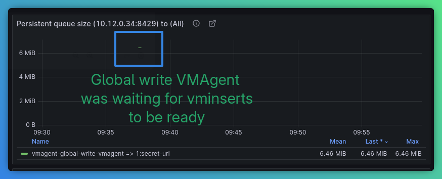
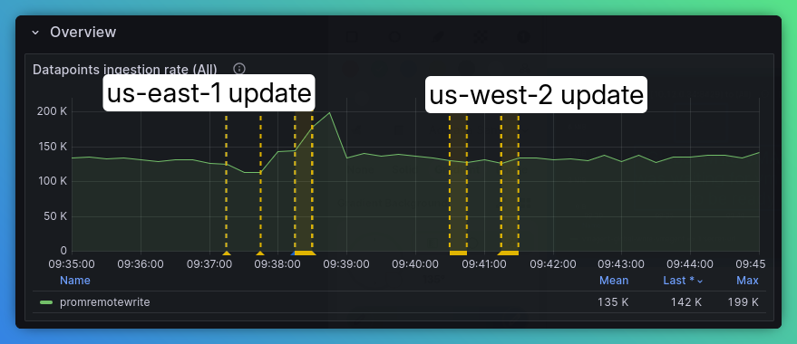
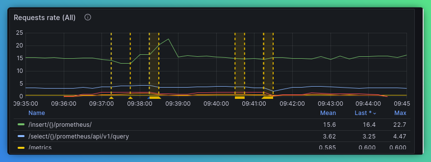
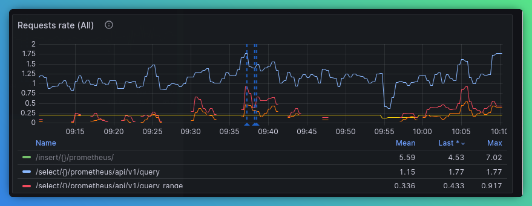
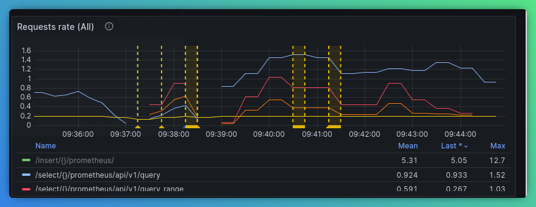
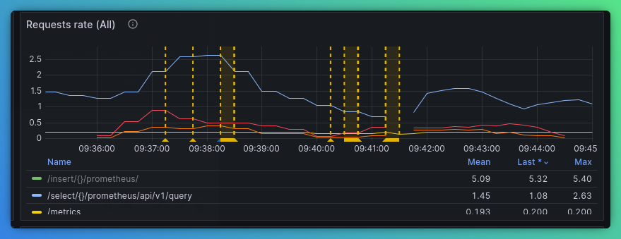

1. Delete default VMCluster
```bash
kubectl -n vm delete vmcluster vmks
```

2. Install new operator
```bash
kubectl apply -f ~/src/github.com/VictoriaMetrics/operator/config/rbac/role.yaml
kubectl create clusterrolebinding operator-binding --clusterrole=operator --serviceaccount=vm:vmks-victoria-metrics-operator
kubectl -n vm apply -f ~/src/github.com/VictoriaMetrics/operator/config/crd/overlay/crd.specless.yaml
kubectl apply -f 01-operator-image.yaml
```

3. Deploy VMDistributedCluster example
```bash
kubectl apply -f 02-vmdistributedcluster.yaml
kubectl -n vm wait --for=jsonpath='{.status.updateStatus}'=operational vmdistributedcluster/vmd --timeout=30m
``` 

4. Reconfigure VMAgent to send k8s and cluster metrics
```yaml
apiVersion: operator.victoriametrics.com/v1beta1
kind: VMAgent
metadata:
  name: vmks
  namespace: vm
spec:
  remoteWrite:
  - url: http://vmagent-global-write-vmagent.vm.svc.cluster.local.:8429/insert/0/prometheus/api/v1/write
```

```bash
kubectl apply -f 03-vmagent.yaml
```

5. Install prometheus-benchmark
```bash
cd ~/src/github.com/VictoriaMetrics/prometheus-benchmark
make install
```

6. Add Grafana datasources:

* Global 
  http://global-read-vmauth.vm.svc.cluster.local:8427/select/0/prometheus
* US East 1
  http://vmselect-vmcluster-us-east-1.vm.svc.cluster.local:8481/select/0/prometheus
* US West 1
  http://vmselect-vmcluster-us-west-2.vm.svc.cluster.local:8481/select/0/prometheus
* EU West 1
  http://vmselect-vmcluster-eu-west-1.vm.svc.cluster.local:8481/select/0/prometheus

7. Update clusters
```yaml
spec:
  zones:
    globalOverrideSpec:
      vminsert:
        extraArgs:
          maxLabelsPerTimeseries: "100"
```

```bash
kubectl patch vmdistributedcluster vmd -n vm --type merge --patch-file 04-vmd-extraargs-patch.yaml
```

8. After cluster update the following metrics show the process:

VMAgent dashboard:


VMCluster Global dashboard - no disruption in write path:


VMCluster Global dashboard - no disruption in read path:


----
EU West cluster as a baseline:


----
US East read is droping right before update:


----
US West read is droping right before update:



6. Distributed chart

Installation:
```bash
helm install vmd vm/victoria-metrics-distributed -f 06-distributed-chart-values.yaml -n  vm
```
