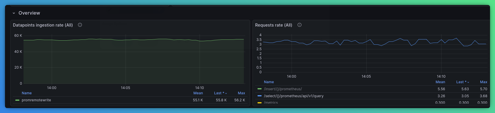
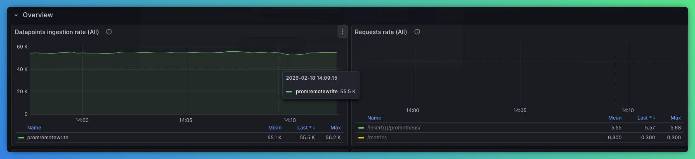
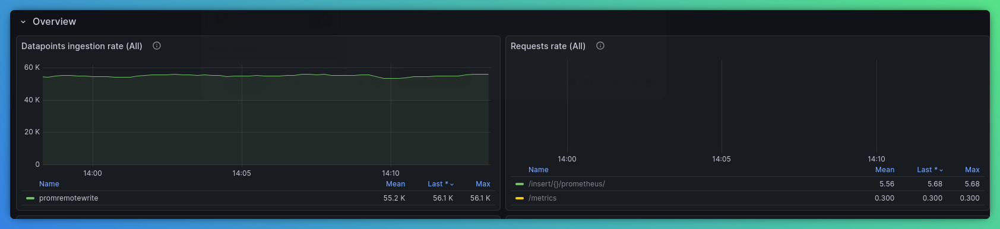
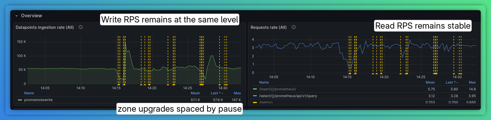
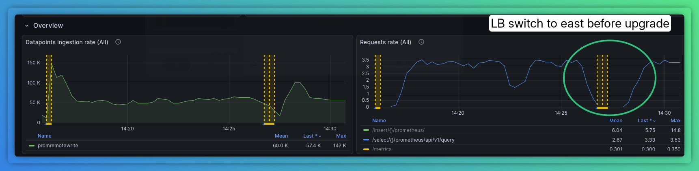
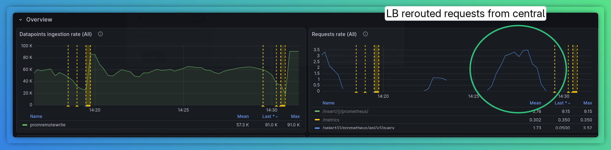
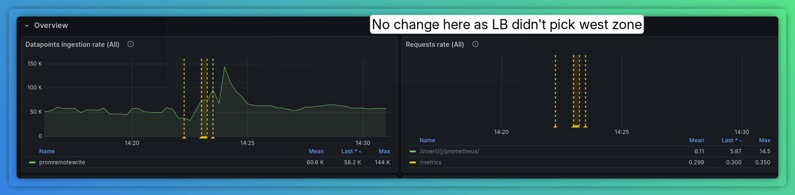

1. Install VM K8s Stack
```bash
kubectl create namespace vm
helm install vmks vm/victoria-metrics-k8s-stack -f 00-k8s-stack.yaml -n vm
```

2. Install new operator
```bash
kubectl apply -f ~/src/github.com/VictoriaMetrics/operator/config/rbac/role.yaml
kubectl create clusterrolebinding operator-binding --clusterrole=operator --serviceaccount=vm:vmks-victoria-metrics-operator
kubectl -n vm apply -f ~/src/github.com/VictoriaMetrics/operator/config/crd/overlay/crd.yaml --server-side --force-conflicts
kubectl apply -f 01-operator-image.yaml
```

3. Distributed chart

Installation:
```bash
kubectl create namespace vm-distributed-chart
helm install vmd vm/victoria-metrics-distributed -f 03-distributed-chart-values.yaml -n vm-distributed-chart
```

4. Setup load test
```bash
cd ~/src/github.com/VictoriaMetrics/prometheus-benchmark
git checkout distributed-chart
make install
```

5. Apply VMDistributed chart which refers to existing resources
```bash
kubectl apply -f 05-vmd-initial.yaml
```

6. Switch benchmark tests to use new VMAuth:
```
cd ~/src/github.com/VictoriaMetrics/prometheus-benchmark
git checkout vmdistributedcr
make install
```

Here's what we'll see on central zone:


East zone:


West zone:



7. Update clusters

```bash
kubectl patch vmdistributed vmd -n vm-distributed-chart --type merge --patch-file 07-vmd-version-patch.yaml
```

`VMDistributed` changes state to `expanding`. VMClusters are sorted by generation and updated one by one:
* VMAgent metrics are checked to make sure persistent queue on disk is empty
* VMAuth config is updated to take out the VMCluster
* VMCluster is updated with the new spec
* The controller waits until VMCluster status is `operational`
* ReadyZone sleep timeout is set (default - 1 minute)
* VMAuth config is updated to include the VMCluster
* GOTO 10

8. After cluster update the following metrics show the process:




----
LB switches off read from central zone before upgrade and turns it on afterwards:


----
Reads are rerouted to east during that time:


----
Nothing is happening on west zone, as LB didn't pick it:


9. Customize each particular cluster
```bash
kubectl patch vmdistributed vmd -n vm-distributed-chart --type merge --patch-file 09-vmd-resources-patch.yaml
```

10. Create all resources from scratch
```bash
kubectl create namespace vmd
kubectl patch vmdistributed vmd -n vmd --type merge --patch-file 10-vmdistributed.yaml
```

11. Pause reconciliation
```bash
kubectl patch vmdistributed vmd -n vmd -p '{"spec": {"paused": true}}'
