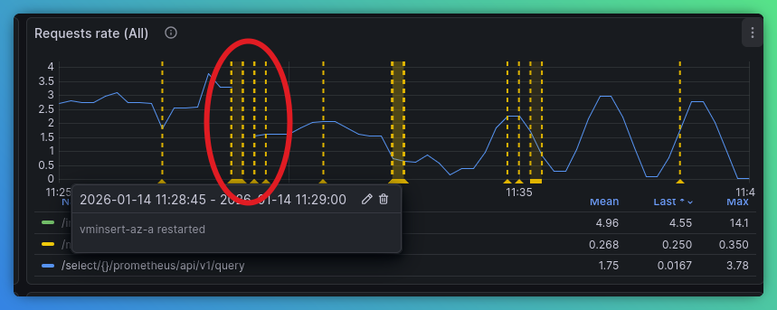
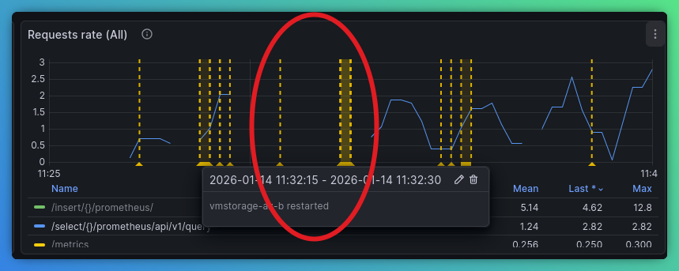
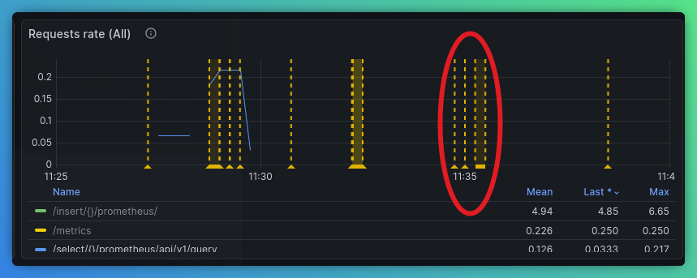

1. Install VM K8s Stack
```bash
kubectl create namespace vm
helm install vmks vm/victoria-metrics-k8s-stack -f 00-k8s-stack.yaml -n vm
```

2. Install new operator
```bash
kubectl apply -f ~/src/github.com/VictoriaMetrics/operator/config/rbac/role.yaml
kubectl create clusterrolebinding operator-binding --clusterrole=operator --serviceaccount=vm:vmks-victoria-metrics-operator
kubectl -n vm apply -f ~/src/github.com/VictoriaMetrics/operator/config/crd/overlay/crd.specless.yaml
kubectl apply -f 01-operator-image.yaml
```

3. Deploy VMDistributed example
```bash
kubectl create namespace vmdistributed
kubectl apply -f 03-vmdistributedcluster.yaml
kubectl -n vmdistributed wait --for=jsonpath='{.status.updateStatus}'=operational vmdistributed/vmd --timeout=30m
``` 

4. Install prometheus-benchmark
```bash
cd ~/src/github.com/VictoriaMetrics/prometheus-benchmark
git checkout vmdistributedcr
make install
```

5. Update clusters

```bash
kubectl patch vmdistributed vmd -n vmdistributed --type merge --patch-file 05-vmd-resources-patch.yaml
```

`VMDistributed` changes state to `expanding`. VMClusters are sorted by generation and updated one by one:
* VMAgent metrics are checked to make sure persistent queue on disk is empty
* VMAuth config is updated to take out the VMCluster
* VMCluster is updated with the new spec
* The controller waits until VMCluster status is `operational`
* ReadyZone sleep timeout is set (default - 1 minute)
* VMAuth config is updated to include the VMCluster
* GOTO 10

6. After cluster update the following metrics show the process:

VMAgent dashboard:


VMCluster Global dashboard - no disruption in write path:


VMCluster Global dashboard - no disruption in read path:


----
No reads on AZ A until zone B update starts:


----
Same for AZ B:


----
And Zone C:


7. Upgrade versions

```yaml
spec:
  zones:
    - name: az-a
      vmcluster:
        spec:
          clusterVersion: v1.135.0-cluster
    - name: az-b
      vmcluster:
        spec:
          clusterVersion: v1.135.0-cluster
    - name: az-c
      vmcluster:
        spec:
          clusterVersion: v1.135.0-cluster
```

```bash
kubectl patch vmdistributed vmd -n vmdistributed --type merge --patch-file 07-vmd-version-patch.yaml
```

8. Distributed chart

Installation:
```bash
kubectl create namespace vm-distributed-chart
helm install vmd vm/victoria-metrics-distributed -f 08-distributed-chart-values.yaml -n vm-distributed-chart
```

Setup load test
```bash
cd ~/src/github.com/VictoriaMetrics/prometheus-benchmark
git checkout distributed-chart
make install
```

9. Apply VMDistributed chart which refers to existing resources
```bash
kubectl apply -f 09-vmd-initial.yaml
```
